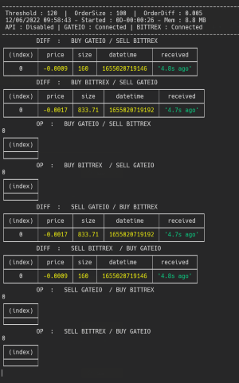

# obot-arbitrage-server
### Ccxws based arbitrage server for [oBot](https://github.com/Olivier-Go/obot-sf-backend)



```sh
# install dependencies
yarn
```

Rename `.env.dist` to `.env`.

```sh
# debug worker 
yarn app

# launch dev server
yarn start

# launch websocket server
yarn ws
```